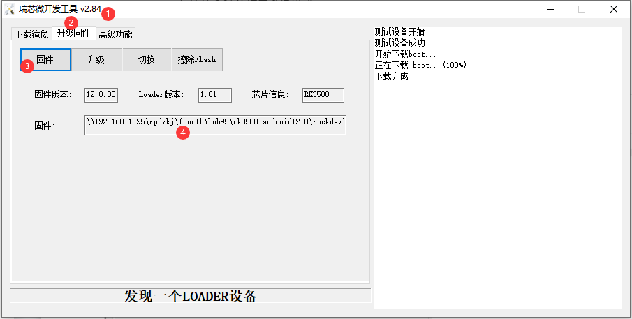
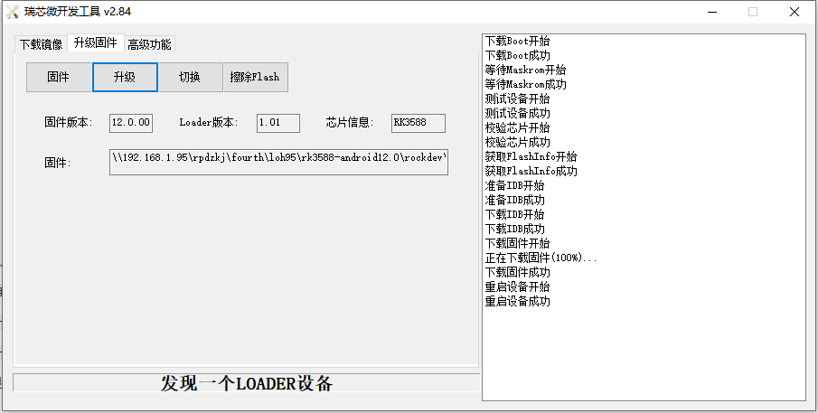
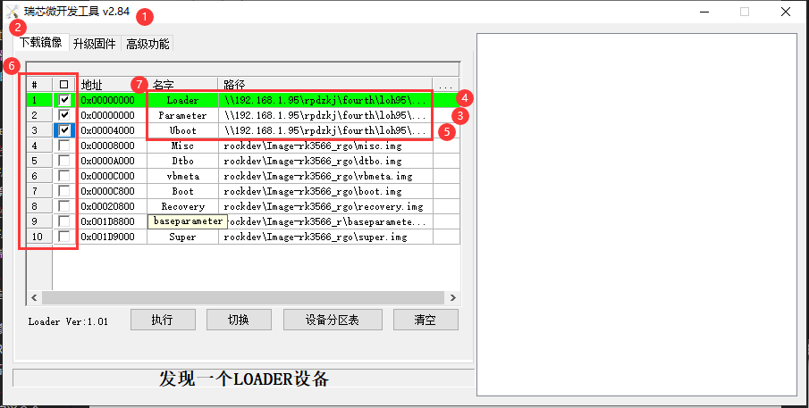
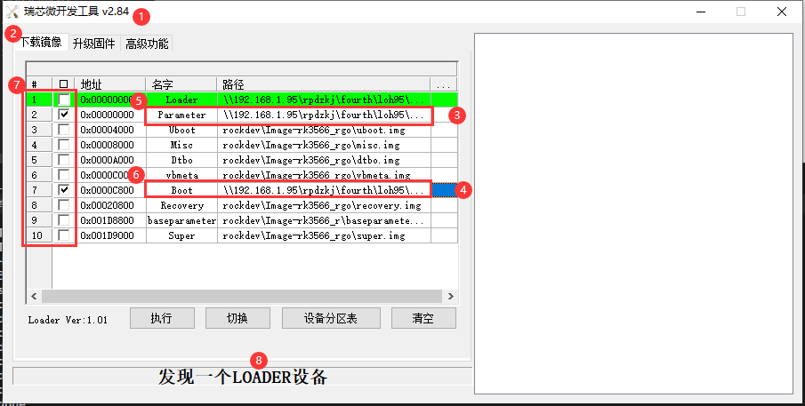
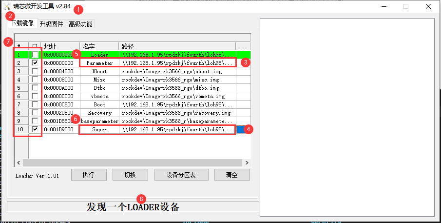
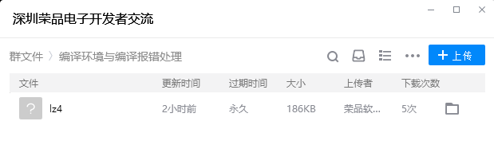
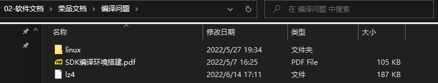

# RK3588-Android12.0 使用指导文档

| 日期      | 作者  | 修改说明 |
| --------- | ----- | -------- |
| 2022-4-15 | tanzh | 初始版本 |


[TOC]


# 1. 芯片基本信息

| CPU  | Cortex-A76 X4 + Cortex-A55 X4 |
| ---- | :---------------------------: |
| GPU  |         Mali-G610 X4          |
| 电源 |            DC-12V             |


# 2. 板型介绍

## 2.1 RD-RK3588


​																	RD-RK3588正面接口说明


​																	RD-RK3588背面接口说明

## 2.2 DR4-RK3588


​					                                           DR4-RK3588接口说明


​																DR4-RK3588接口说明

* <font color=red size=4>TYPE-C 接口为OTG接口</font>


# 3. 编译SDK环境要求

## 3.1 编译设备要求

| 编译设备      | 内存要求 | CPU要求 | 系统版本          |
| ------------- | -------- | ------- | ----------------- |
| Ubuntu真机    | >=16G    | 64位X86 | 64位 Ubuntu18.04  |
| Windows虚拟机 | >=16G    | 64位X86 | 64位 Windows7以上 |


## 3.2 注意事项

1. 编译主机内存：保证分配12G以上

2. CPU线程：  2线程以上

3. SDK目录：**必须**在系统目录下解压编译SDK，不能在外接移动硬盘 或 交换分区里进行操作


## 3.3 低内存编译技巧

| 编译环境内存容量 | 分配线程     |
| ---------------- | ------------ |
| 小于8G           | 不要编译     |
| 8-12G            | 2线程或以下  |
| 12-16G           | 4线程或以下  |
| 16-24G           | 8线程或以下  |
| 24-32G           | 12线程或以下 |


## 3.4 查看系统内存

```
$ free -g
              total        used        free      shared  buff/cache   available
Mem:            125          21           1           0         103         103
Swap:             1           0           1
```

> 解析：total Mem 125 表示内存总量为128GB


## 3.5 查看系统CPU线程数

```
$ cat /proc/cpuinfo | grep processor | tail -n 1
	processor	: 31
```

> 解析：processor  31 表示CPU线程数为32线程


# 4. SDK编译环境配置

参考百度网盘：02-软件文档/荣品文档/编译问题/SDK编译环境搭建.pdf


# 5. 源码获取

## 5.1 下载源码及校验文件

源码百度网盘下载路径：01-SDK/Android12.0/source/rk3588-android12.0-***.tgz

校验文件百度网盘下载路径：01-SDK/Android12.0/source/rk3588-android12.0-***.md5

> ***代表打包时间


## 5.2 源码拷贝到系统

必须要把SDK与校验文件放到系统目录下，不能放到交换分区或虚拟机识别移动硬盘里


## 5.3 源码校验

* 生成源码校验码

  ```
  $ md5sum rk3588-android12.0-***.tgz
  ```

  

* 查看目标校验码

  ```
  $ cat rk3588-android12.0-***.md5
  ```

  > 两者校验码一致，则源码压缩包下载正确无误


## 5.4 源码解压

```
$ tar -xzvf rk3588-android12.0-***.tgz
```

> 源码解压成功后，在当前目录生成.git文件夹


## 5.5 恢复源码

```
$ cd rk3588-android12.0/
$ git reset --hard
```


# 6. 源码编译

## 6.1 硬件版型选择

```
$ ./build.sh init

processing option: init
will build init
==========You're building on Android=========
Please choose BoardConfig
device/rockchip/rk3588
1. BoardConfig-rd-rk3588.mk
```

[具体硬件型号可参考板型介绍章节](#2. 板型介绍)


## 6.2 配置显示屏（非必须）

若使用官方配套显示屏，按照以下步骤配置显示屏，否则显示屏无法点亮


### 配置文件路径

不同板型 配置文件名称不一致，根据 [硬件型号](#2. 板型介绍) 修改配置文件名称

* 示例：rd-rk3588 配置文件路径如下

  ~~~
  $ vim kernel-5.10/arch/arm64/boot/dts/rockchip/rd-rk3588.dts
  ~~~


### 选择显示屏型号

显示屏配置文件 只能选择一个，若要多显请自行配置

* 示例：RD-RK3588 配置MIPI 8寸 1200x1920 显示屏（删除注释符 表示选中对应的显示屏）

  ```
  $ vim kernel-5.10/arch/arm64/boot/dts/rockchip/rd-rk3588.dts
  
  /* lcd */
  //#include "rp-lcd-mipi0-5-720-1280-v2-boxTP.dtsi"
  //#include "rp-lcd-mipi0-7-720-1280.dtsi"
  //#include "rp-lcd-mipi0-8-800-1280-v3.dtsi"
  #include "rp-lcd-mipi0-8-1200-1920.dtsi"
  //#include "rp-lcd-mipi0-10-800-1280-v3.dtsi"
  //#include "rp-lcd-mipi0-10-1200-1920.dtsi"
  //#include "rp-lcd-edp0-13.3-15.6-1920-1080.dtsi"
  //#include "rp-lcd-edp1-13.3-15.6-1920-1080.dtsi"
  //#include "rp-lcd-mipi0-gm8775-lvds-32-1920-1080.dtsi"
  //#include "rp-lcd-mipi0-gm8775-lvds-10.1-1024-600.dtsi"
  ```

  > 配置文件格式解析
  >
  > ​	文件名称：rp-lcd-mipi0-8-1200-1920.dtsi
  >
  > ​	含义：MIPI接口、8寸、分辨率1200x1920


## 6.3 编译源码

```
$ ./build.sh
```

> 编译成功后，在以下目录生成完整镜像文件
>
> ​	rockdev/Image-rk3588_s/update**.img


* 若编译失败，请查看《编译失败排查文档》


# 7. 烧写完整镜像

| 软件类型     | 版本   |
| ------------ | ------ |
| USB驱动      | v5.1.1 |
| 镜像升级工具 | v2.84  |

> 软件版本 必须严格按照上表使用


## 7.1 驱动安装(只需要安装一次)

* 驱动百度网盘下载路径

  `cdrom-rd-rk3588/05-工具/USB烧写驱动/DriverAssitant_v5.1.1.zip`

* 驱动安装步骤


## 7.2 升级工具安装

* 升级工具百度网盘下载路径

  `cdrom-rd-rk3588/05-工具/烧写工具/RKDevTool_Release_v2.84.zip`


## 7.3 打开工具并加载固件


1. `编号1` 确认版本工具（<mark class="hltr-red">版本不对应，会导致无法进入系统</mark> )
2. 点击`编号2` 位置，选择升级固件页面
3. 点击`编号3` 位置，进行固件选择加载
4. `编号4` 显示文件与路径，说明加载固件成功


## 7.4 主板进入升级状态

1. 电脑通过数据线连接到板子的**Type C**接口（开发板接线说明文档）

2. 按住主板的升级按键（开发板接线说明文档）

3. 板子上电（已经上电的情况可以按一下复位键）

4. 3秒后可以松开升级按键

5. 查看升级工具是否发现一个loader设备

6. 若发现不了设备 ，请先排查**Type C**接口是否完全插入，如下图

   


## 7.5 开始升级镜像

1. 点击 <升级> 开始升级镜像



* 若升级失败，请查看网盘：02-软件文档/荣品文档/烧写说明/RK镜像烧写说明及异常问题分析.pdf


# 8. 编译烧写uboot

## 8.1 编译uboot源码

~~~
$ ./build.sh uboot
$ ./build.sh mkimage
~~~

> 编译成功后，在以下目录生成uboot镜像文件
>
> ​	rockdev/Image-rk3588_s/uboot.img


## 8.2 烧写uboot镜像




操作步骤如下：

1. 打开烧写工具，确认工具版本与 `编号1`是否一致
2. 点击 `编号2` 位置进入下载镜像页面
3. 点击 `编号3` 进入`rockdev/Image-rk3588_s`，选择 `parameter.txt`
4. 点击 `编号4` 进入`rockdev/Image-rk3588_s`，选择`MiniLoaderAll.bin`
5. 点击 `编号5` 进入`u-boot/`，选择`uboot.img`
6. 勾选这三个复选框(烧写uboot) 
7. 检查加载路径是否与分区名字是否一样
8.  [参考主板进入升级模式](#7.3 主板进入升级状态)（必须进入Loader模式，不能进入MASKROM模式）
9. 点击<`执行`>


# 9. 编译烧写内核

## 9.1 编译内核源码

~~~
$ ./build.sh kernel
$ ./build.sh mkiamge
~~~

> 编译成功后，在以下目录生成内核镜像文件
>
> ​	rockdev/Image-rk3588_s/boot.img

* 注意事项：Android12.0不能直接烧写kernel.img和resource.img


## 9.2 烧写内核镜像




操作步骤如下：

1. 确认当前工具版本号与`编号1` 是否一致
2. 点击`编号2` 位置进入下载镜像页面
3. 点击`编号3` 位置进入`rockdev/Image-rk3588_s/`，选择 `parameter.txt`
4. 点击`编号4` 位置进入`rockdev/`，选择 `boot.img`
5. 检查加载路径是否与分区名字一致
6. 检查加载路径是否与分区名字一致
7. 勾选这两个复选框(单独烧写内核)
8.  [参考主板进入升级模式](#7.3 主板进入升级状态)（必须进入Loader模式，不能进入MASKROM模式）
9. 点击<`执行`>


# 10. 编译烧写Android

## 10.1 编译Android源码

~~~
$ ./build.sh android
$ ./build.sh mkimage
~~~

> 编译成功后，在以下目录生成Android镜像文件
>
> ​	rockdev/Image-rk3588_s/super.img


* 调试技巧

  若出现修改代码不生效现象，可执行以下命令后再重新编译Android源码

  ```
  $ ./build.sh installclean
  ```


## 10.2 烧写Android镜像




操作步骤如下：

1. 确认当前工具版本号与`编号1` 是否一致
2. 点击`编号2` 位置进入下载镜像页面
3. 点击`编号3` 位置进入`rockdev/Image-rk3588_s/`，选择`parameter.txt`
4. 点击`编号4` 位置进入 `out/target/product/rk3588_s/`，选择`super.img`
5. 检查加载路径文件是否与分区名字一致
6. 检查加载路径文件是否与分区名字一致
7. 勾选这两个个复选框(烧写super分区)
8. [参考主板进入升级模式](#7.3 主板进入升级状态)（必须进入Loader模式，不能进入MASKROM模式）
9. 点击<`执行`>


# 11. 主板升级启动流程分析


1. 当板子从bootloader开始启动
2. 程序会检测升级按键是否给按住
3. 如果给按住了，会进入*device*模式，并与电脑进行通信
4. 如果跟电脑没有连接OTG线，进入*recovery*模式
5. 如果跟电脑有连接OTG线，进入*device*模式
6. 当进入*device*模式后
7. 如果没有安装驱动，电脑设备管理器生成一个设备
8. 如果已经安装驱动，电脑设备管理器生成RK专有的设备驱动名称（*Class for rockusb devices*）
9. 升级工具显示为一个***loader***模式


# 12. 常用源码路径

| 常用配置项         | 源码路径                                               |
| ------------------ | ------------------------------------------------------ |
| RD-RK3588 设备树   | kernel-5.10/arch/arm64/boot/dts/rockchip/rd-rk3588.dts |
| UBOOT默认配置文件  | u-boot/configs/rk3588_defconfig                        |
| 内核默认配置文件   | kernel-5.10/.config                                    |
| Uboot Logo图片     | kernel-5.10/logo.bmp                                   |
| Kernel Logo图片    | kernel-5.10/logo_kernel.bmp                            |
| parameter分区表    | device/rockchip/rk3588/parameter.txt                   |
| device板级配置文件 | device/rockchip/rk3588/                                |


# 13. 更多软件调试文档

## 13.1 SD卡升级固件

参考网盘：02-软件文档/荣品文档/SD 卡升级固件.pdf


## 13.2 OTA升级

参考《OTA升级文档》


## 13.3 写号工具

参考写号压塑包的跟随文档《RKDevInfoWriteTool使用指南 - V1.2.4》


# 14. 编译报错

## 14.1 lz4报错


解决办法:

1. 到QQ交流群，或者网盘下载lz4，放到 /usr/bin/目录





2. 或者到ubuntu2004下的 /usr/bin/ 复制到 ubuntu1804 下的 /usr/bin/目录下